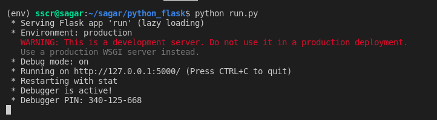
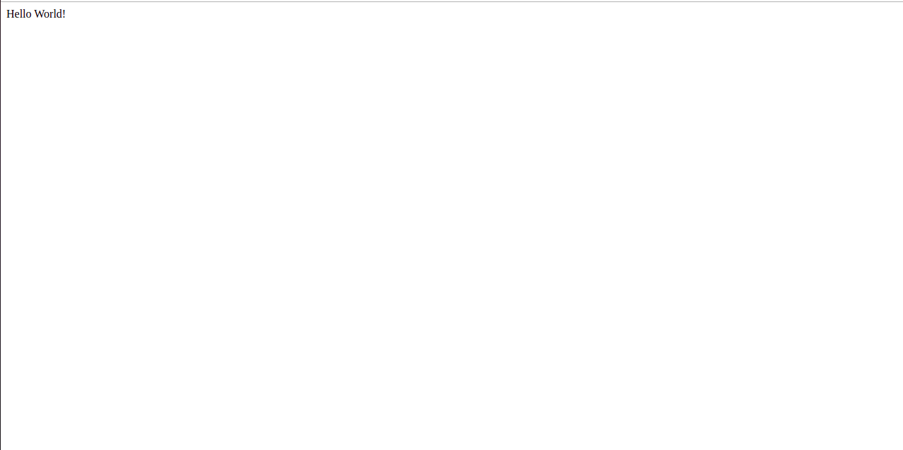

## Python Flask Tutorial

_In this tutorial, we shall see how to build a flask app and use mongo as our database for the development_

### Topics Covered

- Introduction to Flask to develop APIs
- Introduction to Mongo DB
- Running a simple application on Flask
- Connecting Mongo to Flask
- Creating a database (a very simple sales database is considered in the tutorial)
- Using before_request decorators for authentication
- Using Blueprints

### Running the tutorial

- install mongo using the [link](https://docs.mongodb.com/manual/tutorial/)
- clone the repository using git clone https://github.com/shruthisagar/flask_tutorial.git
- create a new virtual enviornment and install all packages using the command
  pip install -r requirements.txt
- creating database and collections

        cd database/
        python create_db.py

- running the flask app - in the parent directory of the repository

        python run.py

- If no errors our application will be running on http://localhost:5000 (by default port 5000)
  
- We can view our website on the browser and it looks like
  
